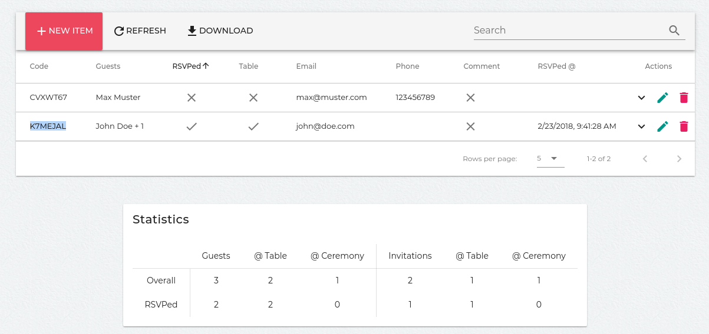

# rsvp-frontend

Depends on [rsvp-backend](https://github.com/aaronlauterer/rsvp-backend).

Made to

* rsvp
  * change name of guests
  * remove or add attending guests
  * add contact information (email, phone)
  * add comment
* manage invitations
  * distinguish invitations to the table or the ceremony only
  * see statistics on how many people responded and if they are invited to the table
  * download as CSV to do further processing

